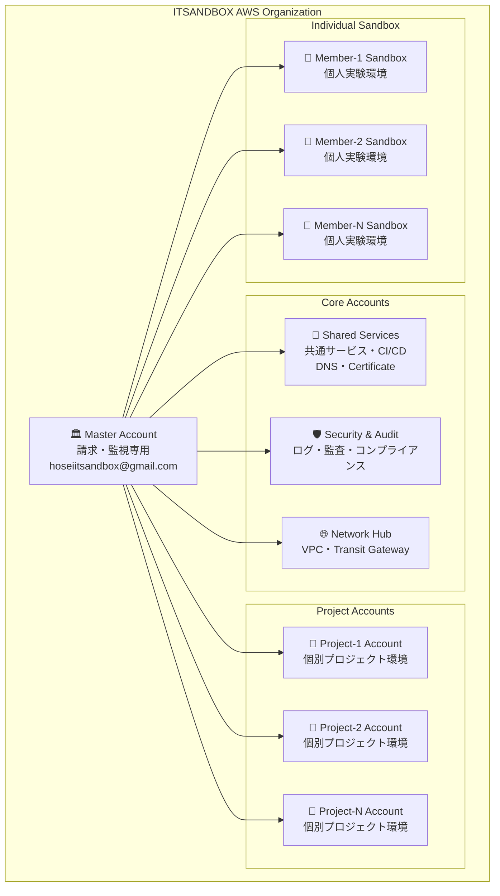
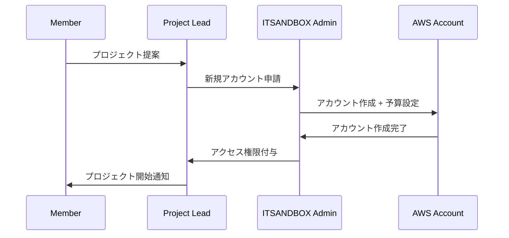

# ITSANDBOX AWS マルチアカウントフレームワーク設計

## 🎯 設計目標

- **複数人の安全な協業** - 個人アカウント隔離 + 共有リソース管理
- **厳格なコストマネージメント** - 月額$100予算の効率的配分・監視
- **スケーラブルな権限管理** - 役割ベースアクセス制御（RBAC）
- **プロジェクト別リソース隔離** - 開発環境の分離と管理

## 🏗️ アーキテクチャ概要



## 💰 コストマネージメント戦略

### 月額$100予算の配分案

| アカウント種別 | 月額予算 | 割合 | 用途 |
|----------------|----------|------|------|
| **Master Account** | $5 | 5% | 請求・監視・組織管理 |
| **Shared Services** | $20 | 20% | DNS・CI/CD・共通インフラ |
| **Security & Audit** | $10 | 10% | ログ・監査・セキュリティ |
| **Network Hub** | $5 | 5% | VPC・ネットワーク |
| **Project Accounts** | $40 | 40% | プロジェクト別（1つあたり$10-20） |
| **Individual Sandbox** | $20 | 20% | 個人環境（1人あたり$2-5） |

### コスト監視・制御システム

```yaml
コスト監視階層:
  Organization Level:
    - 月額$100の厳格な上限設定
    - 80%達成時の全メンバーアラート
    - 90%達成時の新規リソース作成停止
    
  Account Level:
    - アカウント別予算上限設定
    - 日次・週次コストレポート自動配信
    - 予算超過時の自動リソース停止
    
  User Level:
    - 個人別コスト配分・追跡
    - リアルタイムコスト可視化ダッシュボード
    - 個人予算超過時の即座通知
```

## 🔐 権限管理・アクセス制御

### 役割定義（RBAC）

```yaml
管理者役割:
  ITSANDBOX-Admin:
    - 全アカウント管理権限
    - 予算・請求設定権限
    - 新規メンバー招待権限
    - 緊急時のリソース停止権限
    
  ITSANDBOX-ProjectLead:
    - プロジェクトアカウント管理権限
    - チームメンバー管理権限
    - プロジェクト予算管理権限
    
開発者役割:
  ITSANDBOX-Developer:
    - 個人Sandbox環境フルアクセス
    - プロジェクト環境参加権限
    - 共有サービス読み取り権限
    
  ITSANDBOX-Viewer:
    - 監視・ログ閲覧権限
    - コストレポート閲覧権限
    - 共有ドキュメント閲覧権限
```

### Cross-Account Access 設定

```json
{
  "CrossAccountRoles": {
    "ITSANDBOX-CrossAccountDeveloper": {
      "TrustedEntities": ["arn:aws:iam::SHARED-ACCOUNT:root"],
      "Permissions": [
        "Lambda:*",
        "S3:*",
        "DynamoDB:*",
        "CloudWatch:*"
      ],
      "Conditions": {
        "StringEquals": {
          "aws:RequestTag/Project": "${aws:PrincipalTag/Project}",
          "aws:RequestTag/CostCenter": "ITSANDBOX"
        }
      }
    }
  }
}
```

## 🛠️ プロジェクト作成フロー

### 1. 新プロジェクト申請プロセス



### 2. アカウント初期設定テンプレート

```yaml
新規プロジェクトアカウント設定:
  基本設定:
    - Cost Budget: $20/月（プロジェクト規模により調整）
    - Billing Alert: 80%/90%/100%
    - CloudTrail: 有効（Audit Account集約）
    - Config: 有効（コンプライアンスチェック）
    
  ネットワーク:
    - VPC: 10.x.0.0/16（プロジェクト別セグメント）
    - Subnet: Public/Private構成
    - NAT Gateway: 削除（コスト削減）
    
  セキュリティ:
    - IAM Roles: 最小権限原則
    - Resource Tags: 必須（Project/Owner/Environment）
    - Encryption: デフォルト有効
```

## 📊 監視・ダッシュボード設計

### 1. コスト監視ダッシュボード

```yaml
メトリクス:
  Organization Level:
    - 月次予算使用率（$100中の消費額）
    - アカウント別コスト内訳
    - サービス別コスト内訳
    - 前月比較・予測
    
  Project Level:
    - プロジェクト別予算使用率
    - リソース使用効率
    - 最適化提案
    
  Individual Level:
    - 個人別コスト追跡
    - リソース利用状況
    - 学習・実験コスト効率
```

### 2. 運用監視ダッシュボード

```yaml
運用メトリクス:
  セキュリティ:
    - 異常アクセス検知
    - 権限昇格試行
    - コンプライアンス違反
    
  パフォーマンス:
    - リソース使用率
    - アプリケーション応答時間
    - エラー率・可用性
    
  コスト効率:
    - 未使用リソース検知
    - 最適化機会
    - 予算効率ランキング
```

## 🔄 自動化・DevOps 戦略

### 1. Infrastructure as Code

```yaml
Terraform Organization:
  modules/
    - aws-organization/     # Organization設定
    - account-baseline/     # アカウント基本設定
    - project-template/     # プロジェクト環境テンプレート
    - cost-management/      # コスト管理設定
    - security-baseline/    # セキュリティ基準設定
    
  environments/
    - master/              # Master Account設定
    - shared-services/     # 共有サービス設定
    - project-templates/   # プロジェクト別設定
```

### 2. CI/CD パイプライン

```yaml
GitHub Actions Workflows:
  account-provisioning:
    - 新規アカウント作成自動化
    - 基本設定適用
    - セキュリティ設定確認
    
  cost-monitoring:
    - 日次コストレポート生成
    - 予算超過アラート
    - 最適化提案生成
    
  security-compliance:
    - セキュリティスキャン
    - コンプライアンスチェック
    - 脆弱性評価
```

## 🚀 段階的導入計画

### Phase 1: 基盤構築（1-2週間）
- [ ] AWS Organization作成
- [ ] Master Account設定
- [ ] 基本的なコスト監視設定
- [ ] Security & Audit Account設定

### Phase 2: 共有サービス構築（2-3週間）
- [ ] Shared Services Account設定
- [ ] CI/CD パイプライン構築
- [ ] DNS・Certificate管理
- [ ] 監視ダッシュボード構築

### Phase 3: プロジェクト環境テンプレート（1-2週間）
- [ ] プロジェクトアカウントテンプレート作成
- [ ] 自動プロビジョニング実装
- [ ] コスト配分ルール設定

### Phase 4: 個人環境・運用開始（1週間）
- [ ] 個人Sandboxテンプレート作成
- [ ] メンバーオンボーディング
- [ ] 運用ドキュメント整備

## 💡 コスト最適化のベストプラクティス

### 1. リソース最適化
```yaml
自動最適化:
  - 未使用EC2インスタンス自動停止
  - 古いSnapshotの自動削除
  - 未使用EIPの自動検出・通知
  - RDS/ELBの利用効率監視

推奨サービス選択:
  - Lambda > EC2（サーバーレス優先）
  - DynamoDB > RDS（NoSQL優先）
  - S3 + CloudFront > EC2ホスティング
  - EventBridge > Cron（イベント駆動）
```

### 2. 開発効率化
```yaml
共有リソース活用:
  - 共通Lambda Layer
  - 共通Container Image
  - 共通DNS・Certificate
  - 共通監視・ログ基盤

テンプレート化:
  - Terraform Modules
  - CloudFormation Templates
  - Docker Images
  - GitHub Actions Workflows
```

## 🎓 メンバー教育・サポート

### 1. オンボーディングプログラム
- AWS基礎研修（無料枠の効率的活用法）
- コスト意識向上セミナー
- セキュリティベストプラクティス
- Terraformハンズオン

### 2. 継続的学習支援
- 月次技術共有会
- コスト効率化コンテスト
- AWS認定資格取得支援
- プロジェクト成果発表会

この設計により、ITSANDBOXコミュニティは月額$100予算内で複数人が安全に協業できる環境を構築できます！

次は具体的な実装に進みますか？それとも特定の部分をより詳しく設計しますか？